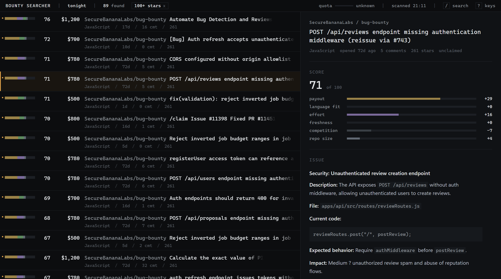

# bounty-searcher

Finds paid GitHub issues and ranks them by how likely you are to actually get
paid for one.

It queries GitHub directly rather than scraping bounty boards, because most
GitHub bounties never reach a board. They are created by a bot comment
(`/bounty 250`), a label (`💰 bounty`), or a maintainer typing `[$500]` into a
title. Aggregator sites only list their own platform's bounties, which is why
they always look out of date.

Scanning and reading are separate. A scan is a crawler topping up a local
database that grows over time; the interface reads that database and never
touches the network. So filtering, sorting and re-scoring are instant, a scan
can run while you are triaging, and no result cap applies to what you can see.



## Setup

```sh
pip install -e .
```

On Windows, double-click `scan.bat`. It installs what is missing, builds the
interface the first time, starts a server on a free port and opens a browser.
Building the interface needs Node; without it the launcher says so and falls
back to the command line.

Everywhere else, or if you prefer a terminal:

```sh
bounty-searcher-web        # the interface
bounty-searcher            # the command line
```

## The token

Optional but strongly recommended: it raises the search limit from 10 to 30
requests a minute, and gives you 5,000 an hour on the core API, which is what
the watchlist and comment reading run on. Create one at
<https://github.com/settings/tokens>; no scopes are needed for public repos.

```sh
export GITHUB_TOKEN=ghp_...          # PowerShell: $env:GITHUB_TOKEN = "ghp_..."
```

If you use `scan.bat`, save the token as `token.txt` next to it instead and the
launcher reads it. That file is gitignored; keep it that way.

## The interface

Two panes: the list, and whatever is selected shown in full. The bar down the
left of each row is the score broken into its six parts, so a column of them
shows the shape of the whole result set without reading a word.

Four saved views, on the number keys:

| Key | View | What it is |
| --- | --- | --- |
| `1` | Tonight | Undecided, unclaimed, best first. The one you will live in. |
| `2` | Payday | What pays most, still going. Unpriced issues are excluded here. |
| `3` | Changed | Already seen, something moved since the last sweep. |
| `4` | All | The whole corpus, nothing hidden. |

The keymap, which is also on `?` in the interface:

| Key | What it does |
| --- | --- |
| `j` / `k` | Next and previous bounty |
| `g` / `G` | First, and last loaded |
| `Enter` | Open on GitHub without leaving the list, so several can be queued |
| `Space` | Give the issue the whole window |
| `c` | Copy a clone command |
| `x` | Dismiss. Hold it to dismiss a run of them under one undo |
| `s` | Shortlist |
| `u` | Undo the last decision |
| `/` | Search titles and repositories. `Escape` clears it |
| `Ctrl`/`Cmd` `K` | Everything else: ordering, filters, start a sweep |
| `?` | The key list |

Decisions are applied immediately and reconciled afterwards, so nothing waits
on the network. Anything you dismiss can be brought back with `u`.

## How the ranking works

The premise is that raw payout is a bad sort key. A $2,000 bounty on compiler
internals in a 90k-star repo is worth less to most people than a $150 bounty on
a small CLI they can fix tonight. The score is six components, which are the
six segments of the rail:

- **Payout**, with hard diminishing returns. `payout_halfway` (default $300) is
  the amount that earns half the maximum, and the curve flattens from there, so
  one large number cannot dominate the ranking.
- **Language fit** against the languages you asked for. Scored only if you name
  one.
- **Effort**, read off the labels: `good first issue` up, `epic` and `rfc` down.
- **Freshness**. Popular bounties are claimed within hours, so age is punished.
- **Competition**. Every comment is one more person who has looked at it, and
  an assignee or a linked PR is usually a dead end.
- **Repository**. Roughly 100 to 20,000 stars is the sweet spot: big enough to
  pay, small enough to merge an outside PR.

Scores are computed from stored fields by pure functions, so changing a weight
re-scores the whole corpus in about a second and never needs a refetch. The
interface shows the breakdown beside every bounty; the command line has
`--explain`.

## The corpus and scanning

GitHub caps any single search at 1,000 results, so a single query can never
find more than that no matter how it is phrased. The planner works around the
cap by generating many narrower queries, each with its own allowance, across
three axes: the search vocabulary, monthly time windows over a lookback, and a
star floor. A query that saturates anyway is split into star bands.

Two sources do not use search at all, and are the cheap ones:

- **The watchlist** lists issues on repositories directly, on the core budget
  of 5,000 an hour rather than search's 30 a minute. Anything that has paid
  before, and anything you shortlist, is added to it automatically.
- **Comment reading** takes the payout from bounty-bot comments on watched
  repositories. Issue search cannot see comments at all, so for those repos
  this is the only way these bounties are visible.

A sweep is resumable: a completed query is recorded and not repeated, so an
interrupted scan continues rather than starts again. Two token buckets pace it
against the search and core limits, synced from the rate limit headers rather
than counted locally. The corpus lives at `~/.bounty-searcher/state.db`.

Measured on one machine over a 50,000 row corpus with real issue bodies: list
queries answer in under 25ms at the 95th percentile, a re-score of the whole
corpus takes about 1.5 seconds, and a cold double-click reaches rows on screen
in about 1.8 seconds.

## Spam filtering

GitHub issue search surfaces a lot of bounty-farming repos: zero-star projects
posting fake payouts, a real example from testing being **$50,000** on a repo
with 0 stars and an AI-generated issue body. A priced bounty from a repo under
`credible_stars` (default 5) stars is flagged suspect and hidden, as is an
implausibly large payout on a mid-size repo. Forks are demoted, since cloned
template repos carry the same seeded bounty issue in every copy.

This will occasionally hide a legitimate brand-new project. `--include-suspect`
shows them, tagged with the reason, and the interface has the same toggle in
the command palette.

Read the limits below before trusting this section too far. It catches the
crude cases and does not catch a farm that clears the star threshold.

## The command line

The command line still does everything it did, and is what makes the tool
composable with a notifier. `--new-only` prints nothing on a quiet run:

```sh
bounty-searcher --lang typescript --new-only --min-score 50 --json
```

```
|   | Score |     Pay | Repo               | Issue                   | Lang  |   Age | Cmt | Stat |
|---+-------+---------+--------------------+-------------------------+-------+-------+-----+------|
|   |    76 |  $1,200 | SecureBananaLabs/b | Automate Bug Detection  | JS    |   17d |  16 | open |
|   |    72 |    $700 | SecureBananaLabs/b | [Bug] Auth refresh acce | JS    |   11d |   0 | open |
|   |    60 |    $500 | Scottcjn/Rustchain | [CAMPAIGN] 5,000 Stars  | Py    |   6mo | 115 | open |

showing 3 of 89 found. Titles are clickable links.
74 collapsed by --per-repo 3: Scottcjn/rustchain-bounties (+48), ...
```

Titles are clickable links in most terminals.

| Flag | What it does |
| --- | --- |
| `--lang X` | Search and favour a language. Repeatable. |
| `--min-amount N` | Hide bounties under `N`. Unpriced ones are kept, since the figure is often negotiated in the thread. |
| `--min-stars N` | Hide small repos entirely. |
| `--min-score N` | Hide anything scoring below `N`. |
| `--per-repo N` | At most `N` bounties per repo, best first (default 3, `0` disables). |
| `--new-only` | Only what this scan added to the corpus. |
| `--budget N` | Requests one sweep may spend (`0` for no limit). |
| `--deep [N]` | Check the top `N` (default 15) for an existing PR or a "working on this" comment. Two extra API calls each. |
| `--explain` | Show the score breakdown per bounty. |
| `--json` | Machine-readable output. |
| `--include-claimed` / `--include-suspect` | Turn off the default filters. |
| `--no-scan` | Read the stored corpus without going near the network. |
| `--forget` | Empty the corpus, so everything counts as new again. |

`scan.bat` with any argument runs the command line rather than the interface,
so a scheduled task calling `scan.bat --new-only --json` behaves as it always
did and reads `token.txt` the same way.

## Configuration

Copy `config.example.toml` to `config.toml`, or to
`~/.bounty-searcher/config.toml`, and edit. Flags override the file. Every key
is documented there with its default.

There are three tables, and the split matters. `[scan]` is what the crawler
goes and fetches, which costs quota and takes minutes: the vocabulary, the
lookback, the star floor, the watchlist, the request budget. `[search]` is what
you are shown out of what it found, which costs nothing. `[scoring]` is the
weights, and changing one re-scores the corpus locally.

## Known limits

- **The interface has no per-repo cap.** `--per-repo` collapses repeats on the
  command line, but it is applied to a page after the fact and there is no
  equivalent in the list API, so one repo filing two hundred bounties fills the
  interface. This is currently the most visible weakness: on a test corpus of
  478 bounties, 70% came from three farming repos and they held every one of
  the top 25 rows. Capping properly means a window function in the list query,
  which has to work with keyset pagination and the total count.
- **Spam filtering misses farms that clear the star threshold.** The suspicion
  rules test stars and implausible payouts. A repo sitting on exactly
  `credible_stars` stars advertising $8,000 passes both, and several do. Raise
  `credible_stars` if this bothers you.
- **Comment bounties are only found on watched repositories.** This was the
  biggest gap and is now mostly closed: bounties that exist only as an
  Algora or Polar bot comment are read directly. But listing comments is a
  per-repository call, so it only covers the watchlist, not all of GitHub.
  Algora and Polar are not queried directly, because neither exposes a working
  public API for this any more.
- **Claim detection is shallow by default**, just the assignee field. `--deep`
  checks for linked PRs and dibs comments, but costs two API calls per issue.
- **Quota is unknown until a sweep has run** in the current process, because
  there is no honest way to know what is left without having asked GitHub. The
  gauge reads "unknown" until then.
- Search still returns at most 1,000 results for any one query. The planner
  slices around it rather than removing it.

## Tests

```sh
pip install -e ".[dev]"
pytest
```

The interface has its own:

```sh
cd web && npm install && npm test
```

## Licence

All rights reserved. See `LICENSE`. This is published for reference, not for
use: no permission is granted to use, copy, modify or distribute it.
